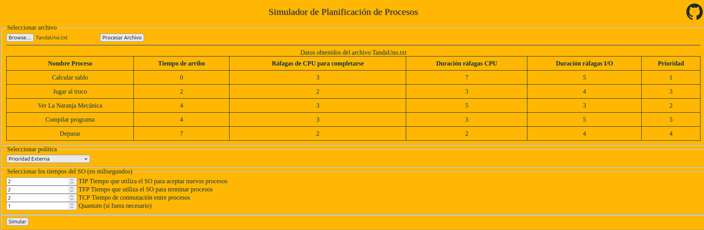
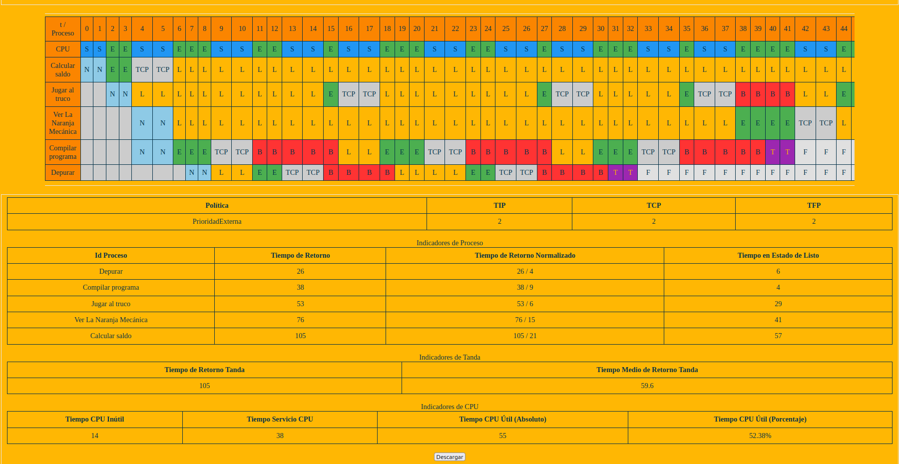

# Simulador de Planificación de Procesos

Este proyecto se realizó en el contexto de la materia Sistemas Operativos del segundo cuatrimestre del tercer año de la carrera Licenciatura en Sistemas de la Universidad Nacional de Tierra del Fuego. El año es 2023.

Simula las políticas de planificación de procesos del sistema operativo al suministrarle una tanda de procesos a través de un archivo *.txt* que el usuario puede suministrar. Además, se puede parametrizar algunos valores propios del sistema operativo como: 
- TIP Tiempo que utiliza el SO para aceptar nuevos procesos
- TFP Tiempo que utiliza el SO para terminar procesos
- TCP Tiempo de conmutación entre procesos
- Quantum (si fuera necesario)
 
Las políticas simuladas pueden ser:
- First Come First Served
- Prioridad Externa
- Round-Robin"
- Shortest Job Next
- Shortest Remaining Time

Se puede descargar una copia de cada una de las simulaciones en formato HTML.

**Para utilizar el simulador simplemente es necesario ejecutar en un navegador el archivo _simulador.html_ del directorio _html_.**

-------------------------------------------------------------

## Cargar tanda de procesos propia
Para cargar una tanda de proceso propia, simplemente se debe crear un archivo txt en el que cada línea representa un proceso. Sus distintas propiedades se representan con valores numéricos separados por comas.
Ejemplo:
Nombre del proceso, tiempo de arribo, cantidad de ráfagas de CPU a emplear para terminar, duración de la ráfaga de CPU, duración de la ráfaga de entrada-salida entre ráfagas de CPU, prioridad externa
Varios ejemplos se pueden encontrar en el directorio _tandas_ de este repositorio.

